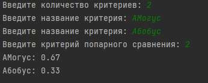

# labsPP
___
Разработал Гвоздев А.М. Фт-210008
---
---
1.    Написать на любом языке программу, реализующую метод анализа иерархий Томаса Саати для одного уровня.
Входные данные: количество критериев, данные попарного сравнения критериев.  

Выходные данные: весовые коэффициенты в виде 0.00 

2.  Обеспечить достаточный уровень качества ПО. Код программы должен содержать комментарии для созданных функций и основных блоков, а также качественный диалог с пользователем и обработку ошибок ввода для минимизации отказов при неправильном вводе. 
---
Открывать файл main.py в любой IDE поддерживающей Python
---
---
Примеры работы программы
---

